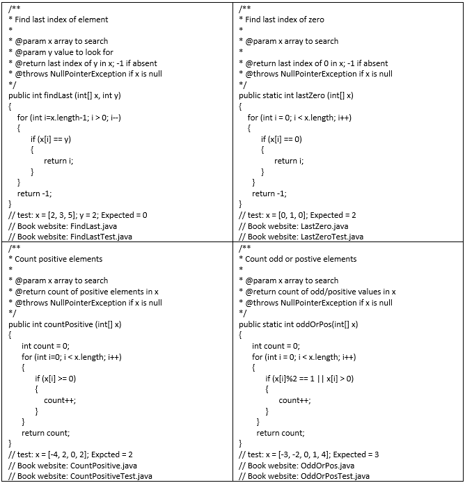

# Homework 1

Below are four faulty programs. Each includes test inputs that result in failure. Answer the following questions about each program.

(a)  Explain what is wrong with the given code. Describe the fault precisely by proposing a modification to the code.  

(b)  If possible, give a test case that does not execute the fault. If not, briefly explain why not.  

(c)  If possible, give a test case that executes the fault, but does not result in an error state. If not, briefly explain why not.  

(d)  If possible, give a test case that results in an error state, but not a failure. Hint: Don't forget about the program counter. If not, briefly explain why not.  

(e)  For the given test case, describe the first error state. Be sure to describe the complete state.  

(f)  Implement your repair and verify that the given test now produces the expected output. Submit a screen printout or other evidence that your new program works.  
