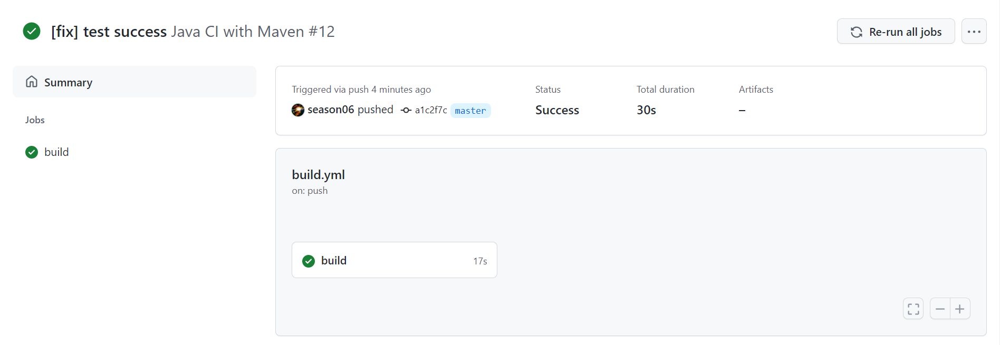
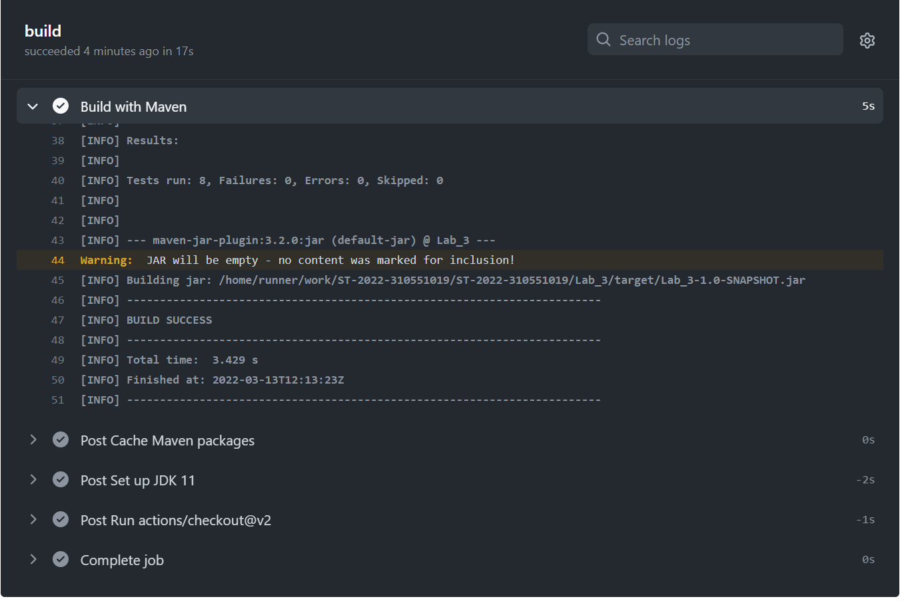
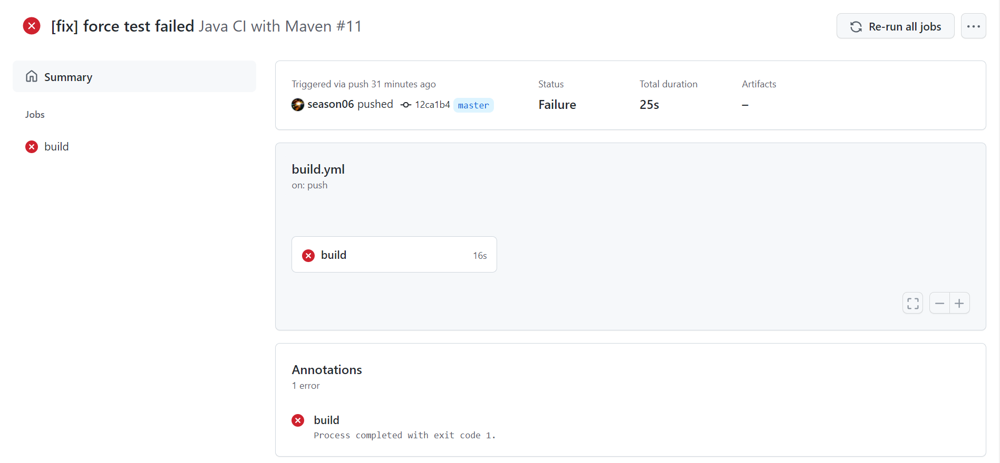
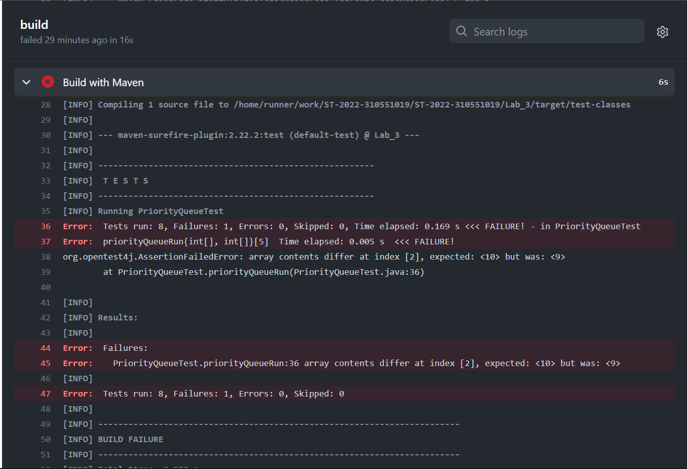

# Continuous Integration

## Part A
- Test **java.util.PriorityQueue class** with Junit.
    - import java.util.PriorityQueue; 
- Parameterization 
    - Each testcase : { random array } , { correct array }. 
        - Random array means to specify **your own input array**. 
        - Correct array means the **PriorityQueue polling correct order** instead of using toArray(). 
        - e.g. arguments(new int[]{5, 4, 2, 3}, new int[]{2, 3, 4, 5}); 
    - Your test must have at least **5** unique testcases. 
- Exception 
    - You have to test at least **3** unique Exceptions that is thrown by PriorityQueue. 
    - The same type of exception in different ways is accepted.

## Part B
- Travis-CI
    - Authorize Travis CI with your Github account.
    - Make sure that Travis CI can be built and test automatically.
- Github
    - Deploy your **Part A (PriorityQueueTest.java)** on Github in public.
    - The name of repository : **ST-2022-student_id**
    - You have to commit twice: 
        - Pass all test cases
        - Unable to pass one of the test cases
    - Add Travis CI status image and screenshots (both pass and fail) to your **README.md**. 
- Submit your Github repository link to E3.

---

## Test Results

### ● Success

### ● Fail

