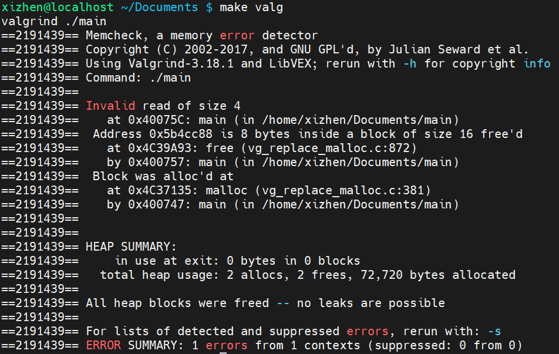

# Software Testing Lab6

- compiler: `g++ (GCC) 8.5.0 20210514 (Red Hat 8.5.0-10)`  
- install & compile  
```bash
sudo yum install valgrind
sudo yum install libasan
g++ -fsanitize=address -o main main.cpp
```

## ● Heap out-of-bounds read/write

### Source Code
```c++
#include <iostream>
int main()
{
        int *ptr = (int*)malloc(2 * sizeof(int));
        return ptr[2];
}
```
### ASan report


### Valgrind report


### Compare
- ASan: yes
- Valgrind: yes

---

## ● Stack out-of-bounds read/write

### Source Code
```c++
#include <iostream>
int main()
{
        int arr[2];
        arr[1] = 1;
        return arr[2];
}
```

### ASan report


### Valgrind report


### Compare
- ASan: yes
- Valgrind: no

---

## ● Global out-of-bounds read/write

### Source Code
```c++
#include <iostream>
int global_arr[2] = {0};
int main()
{
        return global_arr[2];
}
```

### ASan report


### Valgrind report


### Compare
- ASan: yes
- Valgrind: no

---

## ● Use-after-free

### Source Code
```c++
#include <iostream>
int main()
{
        int *ptr = (int*)malloc(2 * sizeof(int*));
        free(ptr);
        return ptr[2];
}
```

### ASan report


### Valgrind report


### Compare
- ASan: yes
- Valgrind: yes

---

## ● Use-after-return

### Source Code
```c++
#include <iostream>
int *x;
void foo()
{
    int num[2];
    x = &num[1];
}
int main()
{
    foo();
    *x = 3;
    return 0;
}
```

### ASan report


### Valgrind report


### Compare
- ASan: yes (sometimes)
- Valgrind: no
 